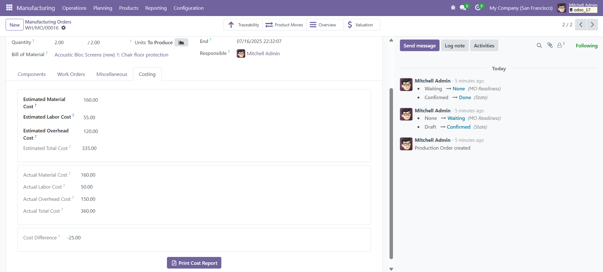
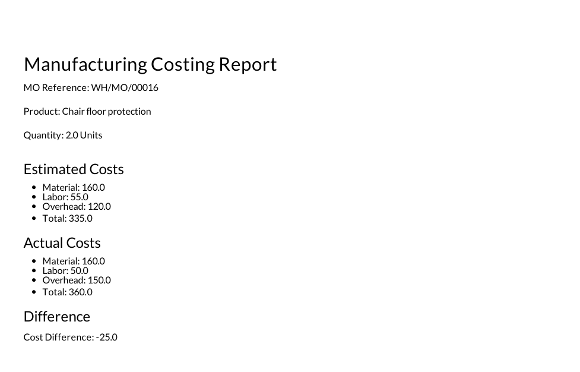

# 🏭 MRP Costing Extension for Odoo

This custom Odoo module extends the Manufacturing (MRP) module to allow estimation and comparison of manufacturing costs. The module introduces fields for:
- Estimated Material, Labor, and Overhead Costs
- Actual Material, Labor, and Overhead Costs (auto-computed)
- Cost Difference (gain or loss)
- PDF report generation for cost analysis

## 🚀 Features

- Adds cost estimation fields to `mrp.production`.
- Computes actual costs based on consumed materials and work orders.
- Shows the cost difference (Estimated - Actual).
- Includes a print-ready PDF report of costing details.

## 📷 Screenshots

### 1. Costing Tab in Manufacturing Order Form


### 3. PDF Report


## 🧠 How it Works

1. You can manually enter the **Estimated Costs** before confirming a Manufacturing Order.
2. Once the MO is processed and finished:
   - **Actual Material Cost** is calculated from raw material consumption.
   - **Labor** and **Overhead Costs** are based on Work Order duration and Workcenter cost rates.
3. The module auto-computes the **Cost Difference**.

## 📄 PDF Report

Click the **Print Cost Report** button to generate a PDF summarizing estimated and actual costs.

## 📂 Module Structure

```plaintext
bi_mrp_process_costing/
├── models/
│   ├── mrp_production.py
│   └── mrp_workcenter.py
├── views/
│   ├── mrp_production_views.xml
│   └── mrp_workcenter_views.xml
├── report/
│   ├── mrp_costing_report.xml
│   └── mrp_costing_report_action.xml
├── __manifest__.py
├── __init__.py
```

---

## ▶️ Installation

1. Place the module inside your `custom_addons` folder.
2. Restart Odoo.
3. Activate **Developer Mode**.
4. Go to **Apps** → Click **Update App List**.
5. Search for **HR Training Management** and click **Install**.
